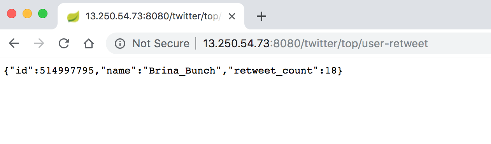
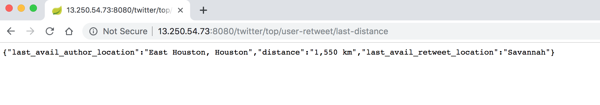
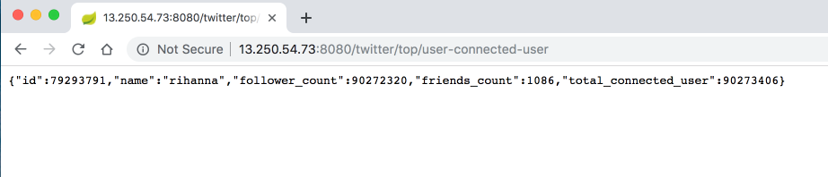
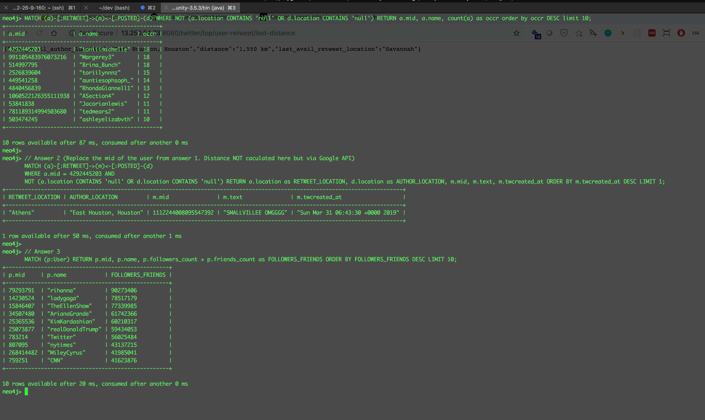
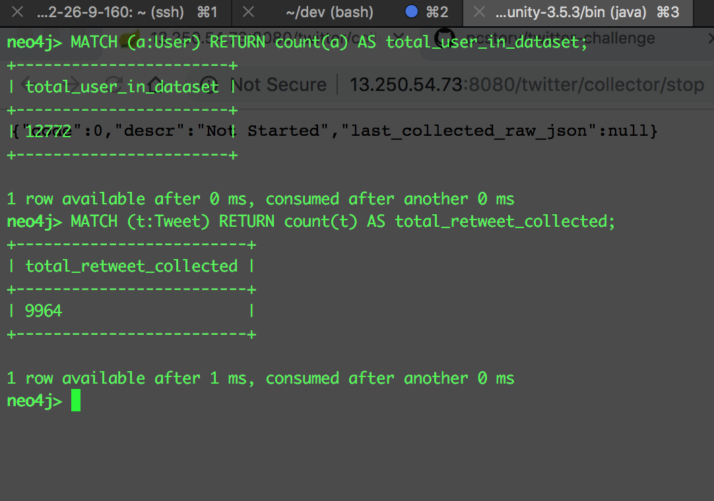
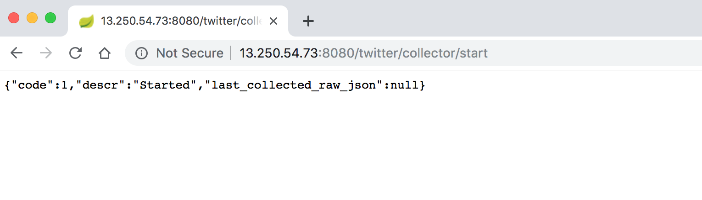
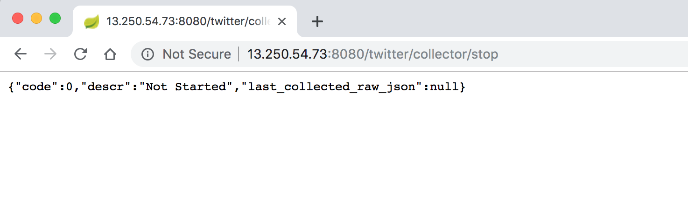
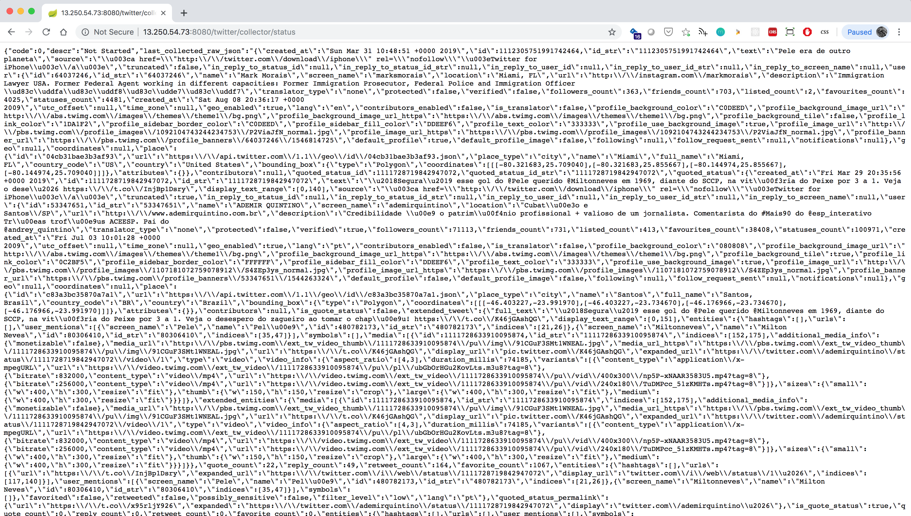

# Readme

## Challenges

A client from United States has approached us with a set of questions to answer using the real time tweets originating from United States.
The questions are:

1. Who is retweeting the most number of tweets?
2. What is the distance from the author to the last retweet?
3. Who is the most connected user in your dataset?

## Deliverables

### 1. Code

- See Github <https://github.com/pcstory/twitter>
  - Data Streaming Code from Twitter
  - Neo4J Cypher Scripts
  - Server Scripts for build and deploy

---

### 2.Connection details to your database which hold your dataset (if any)

- Neo4J server setup in AWS Lightsail, connection string show as below

```bash
./cypher-shell -a bolt://13.250.54.73:7687 -u neo4j -p <In Email>
```

---

### 3.The answers to the questions above

Development Process...

- Collect Data using the streaming API with bounding ```{ -130.56, 23.59 }, { -77.09, 48.77 }``` - US location
- Filter out the data is not **ReTweet**, use regular expression ```\"retweet_count\"\\:[1-9]``` for filtering.
- Log the raw json from the api for tracing purpose.
- Monitor if collected enough data(Tweet and User) with scripts in my Mac...

```bash
watch -n 15 './cypher-shell -u neo4j -p ***** -a bolt://localhost:7687 --non-interactive "MATCH (a)-[:RETWEET]->(m) RETURN a.mid, a.name, count(a) as occr order by occr DESC limit 10;"'

watch -n 5 './cypher-shell -u neo4j -p ***** -a bolt://localhost:7687 --non-interactive "MATCH (t:Tweet) RETURN count(t);"'
```

- Write Cypher script and API to retrieve the result...

```SQL
MATCH (p:User) RETURN p.mid AS id, p.name AS name, p.followers_count AS follower_count, p.friends_count as friends_count, p.followers_count + p.friends_count AS total_connected_user ORDER BY total_connected_user DESC LIMIT 1

MATCH (a)-[:RETWEET]->(m)<-[:POSTED]-(d) WHERE a.mid =$top_user_id AND NOT (a.location CONTAINS 'null' OR d.location CONTAINS 'null') RETURN a.location as last_avail_retweet_location, d.location as last_avail_author_location ORDER BY m.twcreated_at DESC LIMIT 1

MATCH (a)-[:RETWEET]->(m)<-[:POSTED]-(d) WHERE NOT (a.location CONTAINS 'null' OR d.location CONTAINS 'null') RETURN a.mid AS id, a.name AS name, count(a) as retweet_count order by retweet_count DESC limit 1

```

- Use Google Matrix API to calculate the distance dynamically. ```https://maps.googleapis.com/maps/api/distancematrix/json```

- Integrate everything into the api - Data Collection, Cypher Scripts etc.
- Develop deployment script and push to AWS.

---

> P/S. Server IP Address might change (AWS Lightsail Environment)

---

#### Answer 1

URL: <http://13.250.54.73:8080/twitter/top/user-retweet>

```JSON
{"id":514997795,"name":"Brina_Bunch","retweet_count":18}
```



---

#### Answer 2

URL: <http://13.250.54.73:8080/twitter/top/user-retweet>

```JSON
{"last_avail_author_location":"East Houston, Houston","distance":"1,550 km","last_avail_retweet_location":"Savannah"}
```



---

#### Answer 3

URL: <http://13.250.54.73:8080/twitter/top/user-connected-user>

> Distance caclulated with [Google DistantMatrix API](https://developers.google.com/maps/documentation/distance-matrix/start)

```JSON
{"id":79293791,"name":"rihanna","follower_count":90272320,"friends_count":1086,"total_connected_user":90273406}
```



---

#### GraphDB Result Reference

```SQL (Cypher)
// Answer 1
MATCH (a)-[:RETWEET]->(m)<-[:POSTED]-(d) WHERE NOT (a.location CONTAINS 'null' OR d.location CONTAINS 'null') RETURN a.mid, a.name, count(a) as occr order by occr DESC limit 10;

// Answer 2 (Replace the mid of the user from answer 1. Distance NOT caculated here but via Google API)
MATCH (a)-[:RETWEET]->(m)<-[:POSTED]-(d)
WHERE a.mid = 4292445203 AND
NOT (a.location CONTAINS 'null' OR d.location CONTAINS 'null') RETURN a.location as RETWEET_LOCATION, d.location as AUTHOR_LOCATION, m.mid, m.text, m.twcreated_at ORDER BY m.twcreated_at DESC LIMIT 1;

// Answer 3
MATCH (p:User) RETURN p.mid, p.name, p.followers_count + p.friends_count as FOLLOWERS_FRIENDS ORDER BY FOLLOWERS_FRIENDS DESC LIMIT 10;
```



#### Data Collected from real time API (Reference)



---

> 4.What have you learnt through this task?

- Neo4J Graph Database and basic Cypher Query  
- Twitter Data Structure and streaming API
  - Take me a long time to check Twitter **/filter** EndPoint not returning JSON - ***retweeted_status***, but **/sample** EndPoint do return ***retweeted_status***.
  - I assume all the JSON - ***quoted_status*** Tweet is consider the ReTweet for the question.
  - Same to the JSON - ***bounding_box*** result. I assume ***bounding_box*** to calculate the distant between the auhtor but the data is missing randomly.
  - JSON - ***location*** information is not Gaurantee as well.
- Google Distance Matrix API

---

### 5.How much time did you spend

- 3 Days

---

### 6. Why did you choose the language you have used to answer the above questions

- **Java**. For productionalize, compiled language normally safer and faster than scripting language in terms of performacne, more suitable for production implementation.
- Initially I have choosen Python, later I found out there's Streaming API ready in Java which is quite simple to use and I switch to Java.

---

### 7.How would you track down a performance issue in production? Have you done this previously

- Yes, I have done performance tunning previously in Java Web API Tuning, Oracle Query and Apache Hive query tunning. Below is how I would do normally...

- Put timestamp in the code and find out the bottleneck
- Parallelize the Pipeline as possible (Use threads, queue, redesign ETL flow)
- Rewrite Object Orieted Cacluation to Mircorbatch/Full Batch Calculation in PL/SQL
- Find ways to processing the data in memory (Ram), avoid too much IO operation
- Redefine user use case by providing the most important piece of insight on time and delay other processing
- Check Documentation and Google (Database, Programming language normally have advice in documenation... sometimes new idea comes from Documentation)
- Monitor hardware compnents - CPU, RAM, find pattern with Time, incidents ... etc

---

### 8.Please describe yourself using JSON

```JSON
{
  "name": "Heng, Chyn Chwen",
  "contact": "+6592470838",
  "email": "chynchwen@gmail.com",
  "education": [
    "Master of Technology (Software Engineering) – National University Singapore -Institute System Of Science",
    "Bachelor’s Degree with Honours (2nd Upper class) in Computer Science Coventry University(UK)"
  ],
  "certification": ["ITIL Foundation Certified",
    "Certified ScrumMaster (CSM)",
    "Project Management Professional (PMP)",
    "Sun Certified Java Web Developer (SCJWD 1.4)",
    "Sun Certified Java Programmer (SCJP 1.4)",
    "Microsoft Certified Database Administrator (MCDBA2000)"
  ],
  "skills": [{
      "tech-management": ["Solution Design & Architecture", "Team Management", "Project Management", "Scrum", "DevOps"]
    },
    {
      "programming-laguage": ["java", "bash", "python", "javascript", "sql"]
    },
    {
      "cloud": ["AWS", "Cloud Foundry Pivotal"]
    },
    {
      "data": ["BigData", "Hadoop", "Hive", "Spark", "Oracle", "Jupyter"]
    },
    {
      "framework": ["Kafka", "Springboot", "Hibernate", "nodejs", "ReactJS", "Angular"]
    },
    {
      "tools": ["Jenkins", "Jira", "Confluence", "Visual Studio Code", "Eclipse"]
    }
  ],
  "employment-history": [{
      "name": "Merck & Co.",
      "title": "Tech Lead",
      "from-to": "July 2016 – Current",
      "description": [
        "Delivery Lead for Big Data Solution",
        "Collaborate with Data Scientist and Business Analyst for Big Data Solution Project and PoC",
        "Productionalize Data Scientist POC",
        "Full-Stack Application Development and Implementation to production with CICD concept",
        "Develop and configure Big Data Platform supporting components",
        "Automate Hadoop Clusters setup in AWS with Ansible scripts (Infrastructure as code)",
        "Team coaching, mentoring and hiring",
        "Inter Company Pre-Sale of Software Engineering Department"
      ]
    },
    {
      "name": "DBS Bank",
      "title": "Tech Lead",
      "from-to": "May 2015 – May 2016",
      "description": [
        "Technical Lead",
        "Application Architecture design, Framework Selection",
        "Backend Development and implementation Workflow Engine, Scheduler, Service Layer etc",
        "Requirement Gathering",
        "CI Automation, deployment",
        "Apache Hadoop, Hive POC",
        "Troubleshooting Front End Modules"
      ]
    },
    {
      "name": "AdNovum",
      "title": "Senior Software Engineer",
      "from-to": "Aug 2014 – Apr 2015",
      "description": [
        "Stream Lead",
        "Resource Planning, effort estimation",
        "Requirement Analysis",
        "Application design, integration, construction & implementation",
        "Software Architecture Documentation",
        "Lias with client & vendors",
        "Alexandria Award (Outstanding Performance Team)"
      ]
    },
    {
      "name": "Moodys Analytics ",
      "title": "Assistant Director Senior Software Engineer ",
      "from-to": "Aug 2012 – Jul 2014",
      "description": [
        "Module lead, Stream lead",
        "Application design integration",
        "Code review, Refactoring, mentoring junior team member, contractors",
        "Working with different streams and BAs located in SG, China ShenZhen and Australia",
        "Resource Capacity Planning, Stories estimation, SCRUM retrospective",
        "Build and configured functionality within custom MVC framework (Adobe Flex)",
        "HTML5, AngularJS in iPad development",
        "Spring, Hibernate and Oracle in backend development",
        "Eclipse BIRT Reporting Module upgrade"
      ]
    },
    {
      "name": "Manulife Pte Ltd",
      "title": "Senior Analyst Programmer",
      "from-to": "Jan 2011 – Jul 2012",
      "description": [
        "Module enhancement,  SIT, system support, Documentation",
        "Data center application migration planning and execution for Agent Web System",
        "Oracle Application Server to WebLogic Server migration",
        "LOMA 280 Certified"
      ]
    },
    {
      "name": "HP Asia Pacific Singapore ",
      "title": "Senior Software Engineer",
      "from-to": "Dec 2006 – Dec 2010",
      "description": [
        "Global Channel Partner IT group, EMEA and US (Channel Compensation) Team",
        "Enhancement planning, design, development and application support (24x7)",
        "Team leading and co-ordination with worldwide IT team"
      ]

    },
    {
      "name": "Unidux Electronics Limited ",
      "title": "Java Programmer",
      "from-to": "Nov 2005 – Nov 2006",
      "description": [
        "Report designing, JasperReport, DB2-AS400, Movex",
        "Design, develop report engine using JBoss-MQ, JMS, Jasper Report and integrate with existing report engine.",
        "Movex ERP-BPW (reporting tool) report design and development.",
        "Intranet application design, development and maintenance, JSP, Tomcat, Struts, MySQL, Open source libraries.",
        "Application bug fixing"
      ]
    },
    {
      "name": "CSC-CSA Singapore",
      "title": ": Software Engineer (PSA, Contract)",
      "from-to": "Jan 2005 – Oct 2005",
      "description": [
        "System Development and Implemenation",
        "APIS – Automatic Position Indication System",
        "QCI – Quay Crane Interface",
        "QCO – Quay Crane Operator"
      ]
    }
  ]

}
```

---

## Optional Challenge

```Text
Do feel free to recommend additional features in which you think will improve this piece of code in production.
Something that we can think of is:
1. How would you serve this through an API?
2. How would you package this in an deployable and trackable fashion?
```

### Optional Challenge - Answer 1

Developed API for the realtime collection, please refer to  ***TwitterRealTimeDataService.java*** and ***TwitterController.java***

Start real-time streaming. - <http://13.250.54.73:8080/twitter/collector/start>

```json
{"code":1,"descr":"Started","last_collected_raw_json":null}
```



Stop real-time streaming. -<http://13.250.54.73:8080/twitter/collector/stop>

```json
{"code":0,"descr":"Not Started","last_collected_raw_json":null}
```



Check collector Status using api <http://13.250.54.73:8080/twitter/collector/status>



### Optional Challenge - Answer 2

- Use Maven the package, see ***build.sh***
- Deploy script to move the package, see ***deploy.sh***
- Data Tracability, all data captured with unique ID
  - Streaming code use ***MERGE*** if record already exits
  - Setup GraphDB for record uniqueness

```SQL
MATCH (n) DETACH DELETE n;

DROP CONSTRAINT ON (P:User) ASSERT P.mid IS UNIQUE;
DROP CONSTRAINT ON (T:Tweet) ASSERT T.mid IS UNIQUE;

CREATE CONSTRAINT ON (P:User) ASSERT P.mid IS UNIQUE;
CREATE CONSTRAINT ON (T:Tweet) ASSERT T.mid IS UNIQUE;
```

#### Production Recommendation

- Construct more unit test and automated SIT
- Configure DevOps/CICD automated deployment with Jenkins
- Use queue technique such as Kafka to increase streaming performance and achieve high availability
- Use Docker and Kubenetes for scalling the nodes
- Data Streaming Code
  - Proper logging in log file, currently the logging is not complete
  - Parameterize the User and Password in the Data Streaming Code
- Redefine the data model to store in Neo4J for future integration, I only store the mininum data needed for the question
- Explore other endpoint to collect more User Data
- GraphDB
  - Should have better way to write the query (Will explore more if I have more time)
- Setup security for the API (Token keys, OAuth ... etc)
